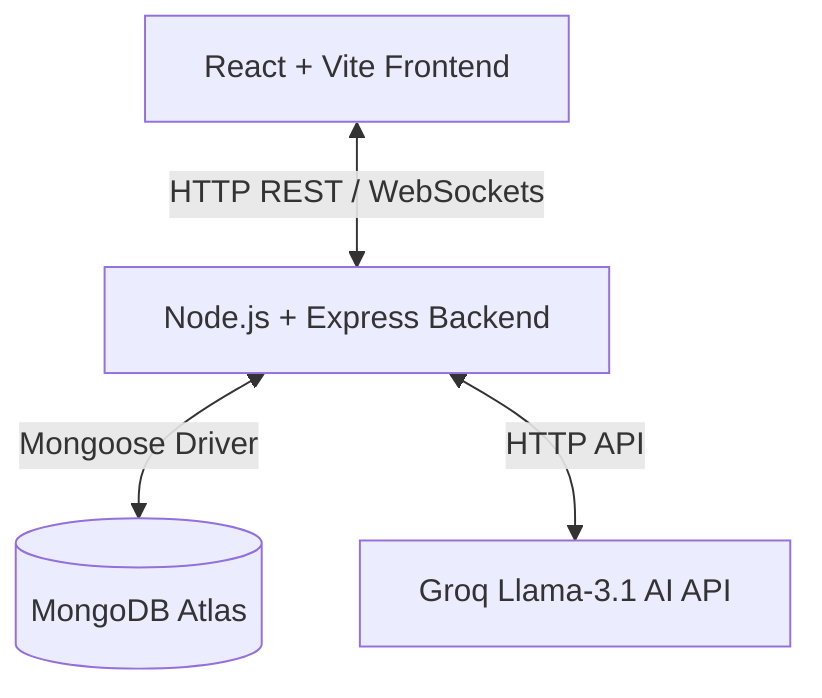
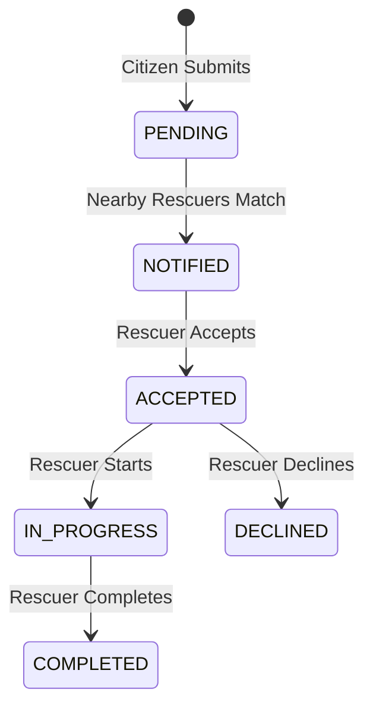

# High-Level Design (HLD) — Animal Rescuer

## 1. System Architecture
The application follows a standard **Client-Server-Database** architecture, decoupled to scale independently:

---

## 2. Component Design

### 2.1 React Frontend Client
*   **Routing**: Decided by `react-router-dom`. Contains authentication guards to separate dashboards based on roles.
*   **State Management**: Context-based global states (`AuthContext`, `SocketContext`) coupled with local component states (`useState`).
*   **Maps & Leaflet**: Embedded interactive OpenStreetMap integration (Leaflet) using coordinates to display pinned animal report locations and rescuer positions.

### 2.2 Express Backend Server
*   **HTTP Layer**: Standard REST API serving register, login, report submission, and settings updates.
*   **WebSocket Layer**: Built with `socket.io` to manage persistent state connections. Maps connected client socket IDs to Mongoose user IDs.
*   **Multer File Upload**: Middleware parsing files and saving them with unique crypto hashes locally under `/uploads`.

### 2.3 MongoDB Atlas Geospatial Store
*   Houses the primary system state.
*   Uses `2dsphere` indexes on user and report coordinates.
*   Queries matching rescuers dynamically using `$near` geometry filters.

---

## 3. Core System Workflows

### 3.1 Report Submission and Nearby Notification
1.  **Citizen** submits report with file upload (photo) and coordinate selection.
2.  Backend stores details, saving the photo path in `imageUrl`.
3.  Backend queries MongoDB for available `RESCUER` users whose configured `location` and `rescueRadius` encompass the report's coordinates.
4.  For every matched rescuer, the backend creates a DB notification record and emits a Socket.io `new_rescue_request` message to their personal room.

### 3.2 Rescue State Management

*   Updates emit a `rescue_status_update` Socket event to notify the Citizen dashboard in real-time.
